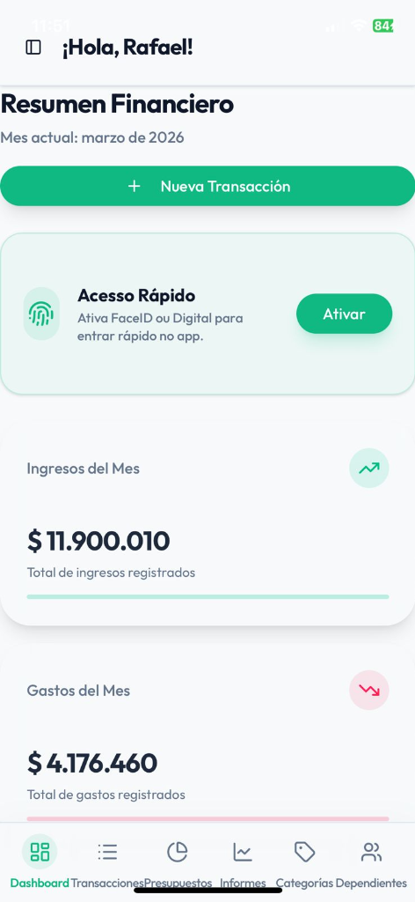

# Finanzas-APP - Agente Financeiro Familiar

> Controle financeiro pessoal e familiar com IA via WhatsApp. Simples como enviar uma mensagem.

---

## Para quem nao e tecnico

**Como funciona:**
- Voce manda uma mensagem no WhatsApp: "gastei 50.000 no supermercado"
- O assistente de IA registra automaticamente
- No app voce ve graficos de quanto gastou por categoria
- A IA avisa quando seu gasto esta acima do normal

**Para toda a familia:**
- Cada membro da familia tem seu perfil
- O app mostra quem gastou mais em cada categoria
- Relatorios mensais comparativos

---

## Preview do App

---

## Funcionalidades

- Registro de gastos via WhatsApp com IA
- Dashboard com graficos de receitas x despesas
- Categorizacao automatica (Alimentacao, Transporte, Saude...)
- Perfis familiares separados
- Analise comparativa mensal
- Alertas inteligentes da IA

---

## Stack Tecnica

| Tecnologia | Uso |
|-----------|-----|
| Next.js 15 | Frontend web |
| Supabase | Banco de dados + Auth |
| n8n | Automacao de workflows |
| WhatsApp Business API | Integracao de mensagens |
| Google Gemini AI | Processamento de linguagem natural |

---

## Contato

Desenvolvido por **Dioran Rodriguez** - diorato@live.com
